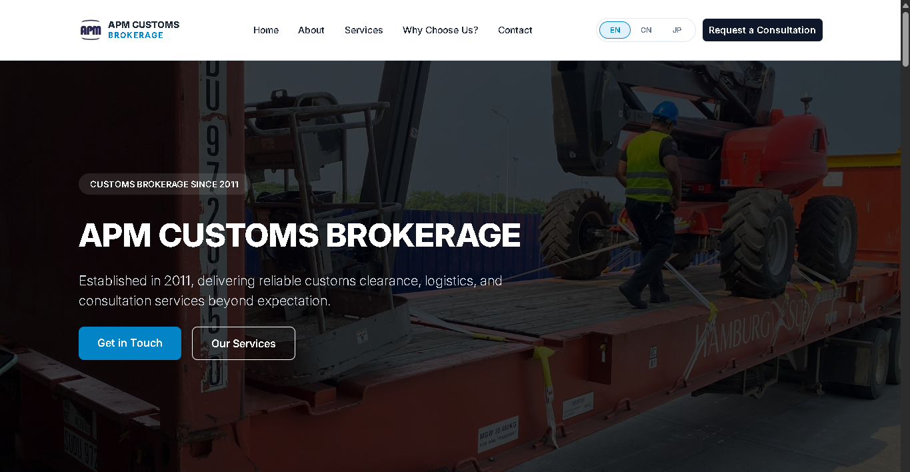
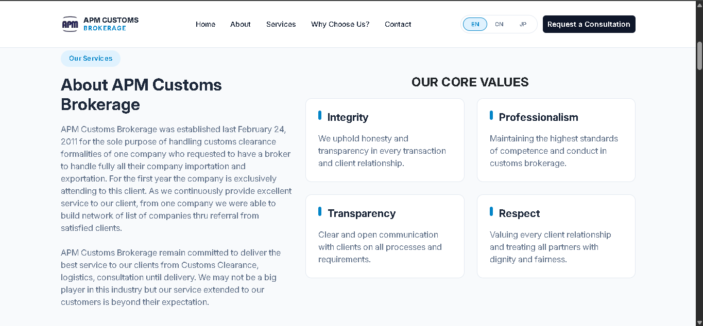
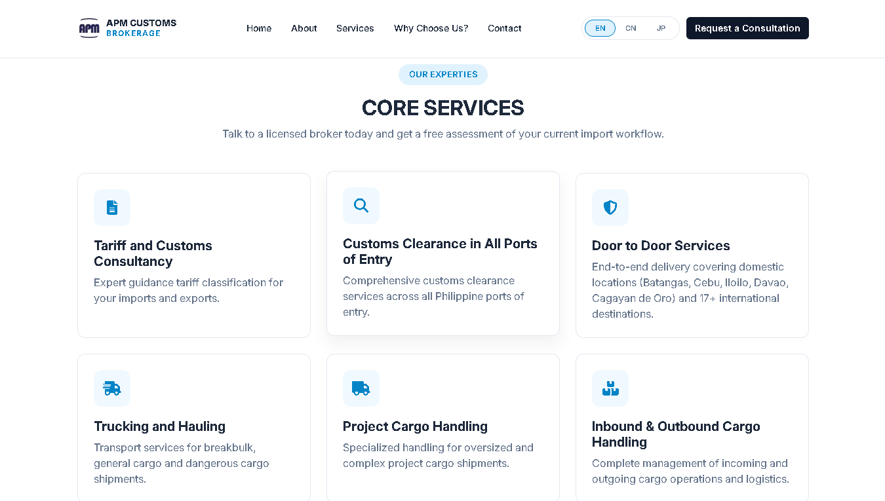
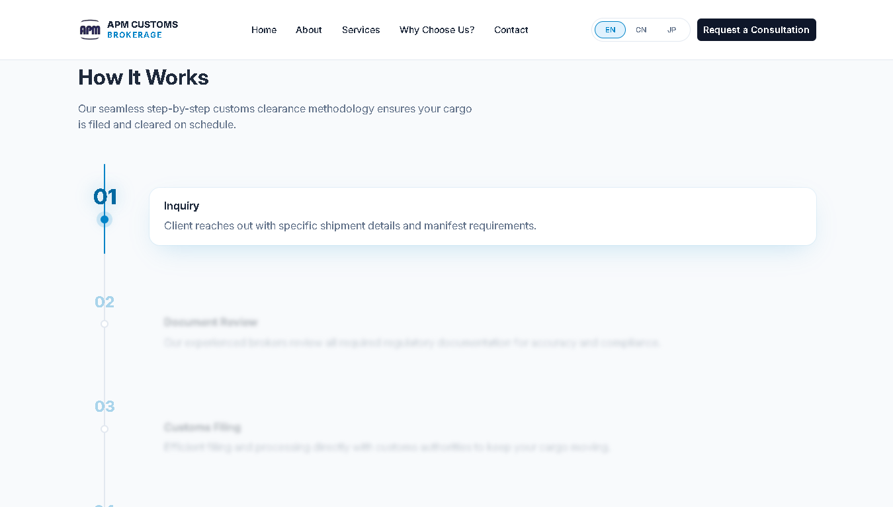
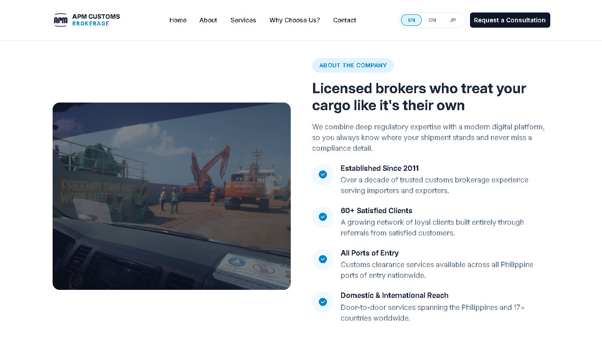
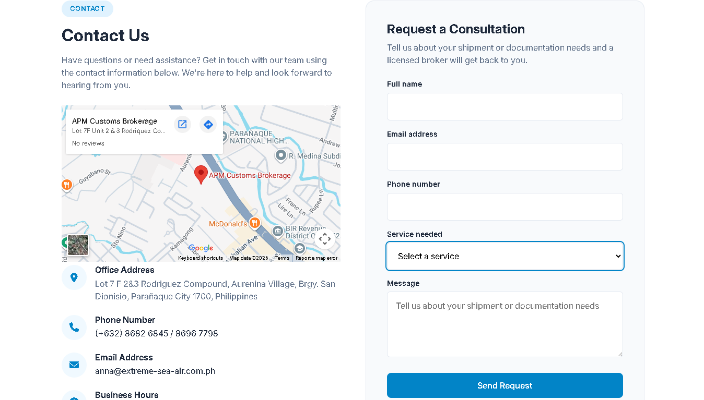

# APM Customs Brokerage — Website

> A responsive static corporate website for APM Customs Brokerage, built to showcase company services and generate client inquiries through a client-side contact form.


---

## Table of Contents

- [Description](#description)
- [Features](#features)
- [Demo / Screenshots](#demo--screenshots)
- [Installation](#installation)
- [Project Structure](#project-structure)
- [License](#license)
- [Contact / Support](#contact--support)
- [Acknowledgments](#acknowledgments)

---

## Description

This project is a **static, responsive corporate website** built for **APM Customs Brokerage**, a licensed Philippine customs brokerage firm established in 2011. The site presents the company's profile, core values, services, and workflow, and gives prospective clients a way to request a consultation directly from the page.

**Problem it solves:** APM Customs Brokerage previously had no dedicated web presence to communicate its services, credibility, and contact information to prospective importers/exporters. This site provides a professional, mobile-friendly landing point that:

- Introduces the company and its core values to visitors
- Explains the customs clearance workflow in a clear, step-by-step format
- Captures consultation requests without requiring a backend server
- Supports EN / Simplified Chinese / Japanese visitors via an in-page translation switcher

**Target audience:**
- **End users:** Prospective and existing clients (importers/exporters) looking for customs brokerage services

---

## Features

- **Fully responsive layout** built on Bootstrap 5.3.3's grid and utility classes
- **Multilingual switcher** (EN / 中文 / 日本語) powered by the Google Translate Website Widget, with a debounced/settle-aware UI so the interface stays responsive during translation
- **Client-side contact form** with full HTML5 + JS validation, honeypot spam protection, and email delivery via EmailJS
- **Scroll-triggered fade-up animations** for sections and their children, respecting `prefers-reduced-motion`
- **Interactive scroll-synced workflow timeline** highlighting the active step as the user scrolls, with an animated progress rail
- **Accessible mobile navigation** with outside-click and resize-aware auto-close behavior
- **Embedded Google Map** of the office location in the Contact section
- **SEO/Open Graph meta tags** for improved link previews and search indexing

---

## Demo / Screenshots








---

## Installation

This is a static site with **no build step and no backend server** — it can be run by opening the HTML file directly or serving it with any static file server.

### Prerequisites

- A modern web browser (Chrome, Firefox, Edge, Safari)
- An [EmailJS](https://www.emailjs.com/) account if you intend to modify or redeploy the contact form

### Steps

1. **Clone the repository**
   ```bash
   git clone [Insert repository URL]
   cd [Insert project folder name]
   ```
---

## Project Structure

```
.
├── index.html                     # Main HTML document (all page sections)
├── assets/
│   ├── css/
│   │   └── style.css              # Site-wide styling
│   ├── js/
│   │   └── main.js                # Language switcher, form validation, animations, nav
│   └── images/
│       └── logo.jpg               # Company logo (navbar, footer, favicon, OG image)
└── documentation/
    └── content-source-list.txt    # Full content & asset attribution log
```

---

## License

This project is licensed under the **[MIT License]**. See the [LICENSE](./LICENSE) file for details.

> Note: Third-party libraries used in this project (Bootstrap, Font Awesome, EmailJS SDK) retain their own licenses (MIT, Font Awesome Free License). See `documentation/content-source-list.txt` for full attribution.

---

## Contact / Support

For business inquiries related to APM Customs Brokerage services:
- **Office:** Lot 7 F 2&3 Rodriguez Compound, Aurenina Village, Brgy. San Dionisio, Parañaque City 1700, Philippines
- **Phone:** (+632) 8682 6845 / 8696 7798
- **Email:** anna@extreme-sea-air.com.ph

---

## Acknowledgments

- **Company content** sourced from the APM Customs Brokerage company profile, supplied by Annabella P. Maniego (General Manager) and Claire F. Capistrano (Business Development Manager)
- **Bootstrap 5.3.3** — MIT License
- **Font Awesome 6.7.2** — Font Awesome Free License
- **Google Fonts (Inter)** — SIL Open Font License 1.1
- **EmailJS Browser SDK v4** — MIT License
- **Google Translate Website Widget** — Google Translate Element API
- **Google Maps Embed API**
- Full source and licensing attribution: see `documentation/content-source-list.txt`

---
